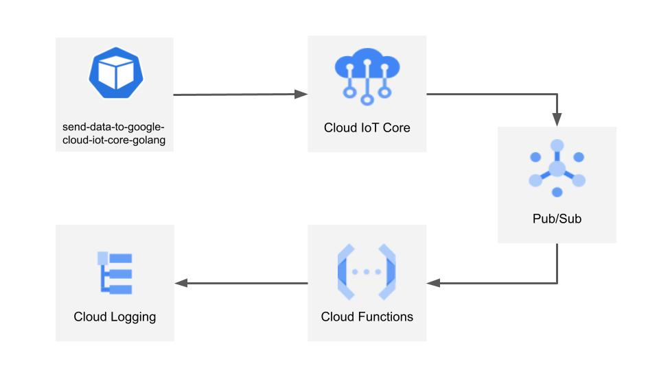
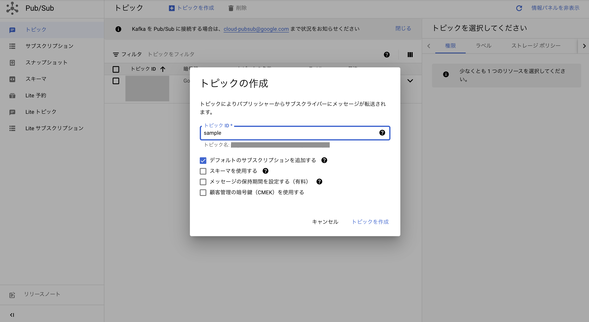
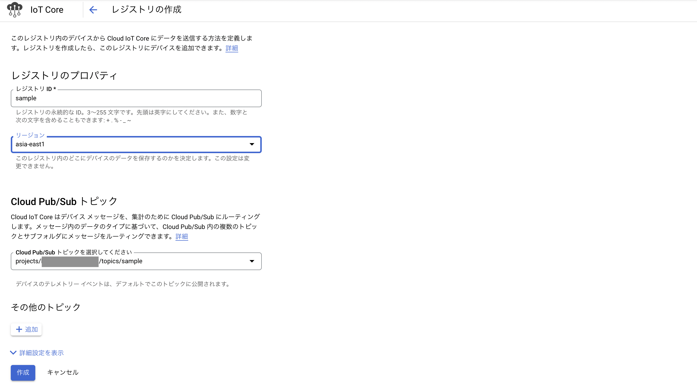
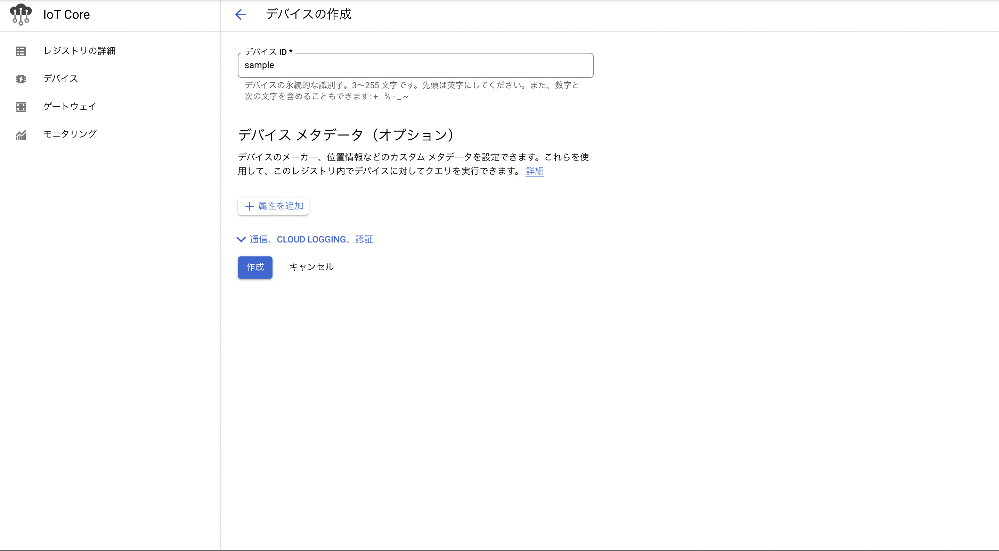
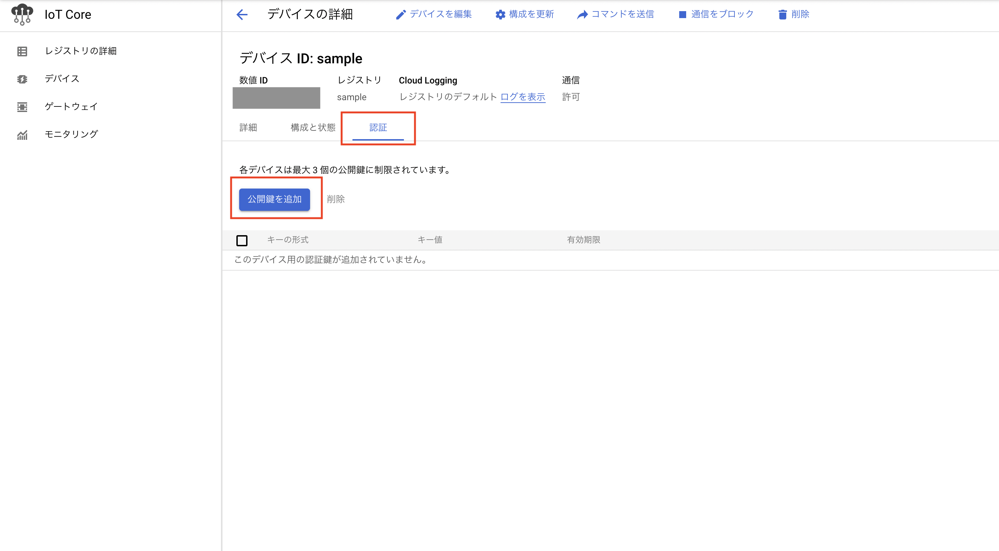
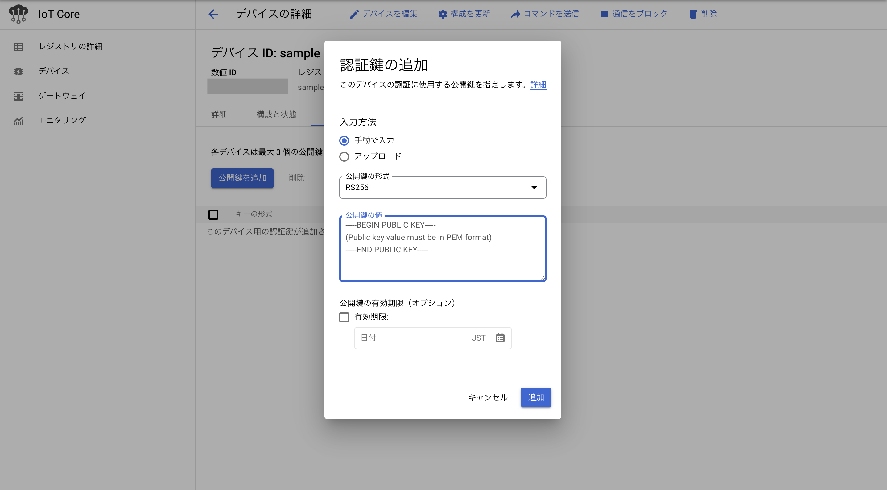
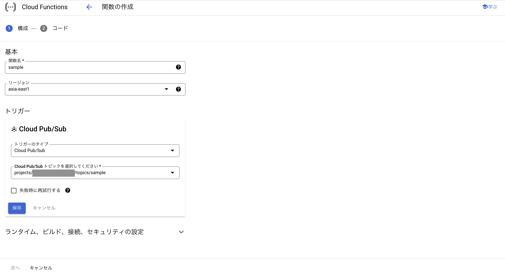
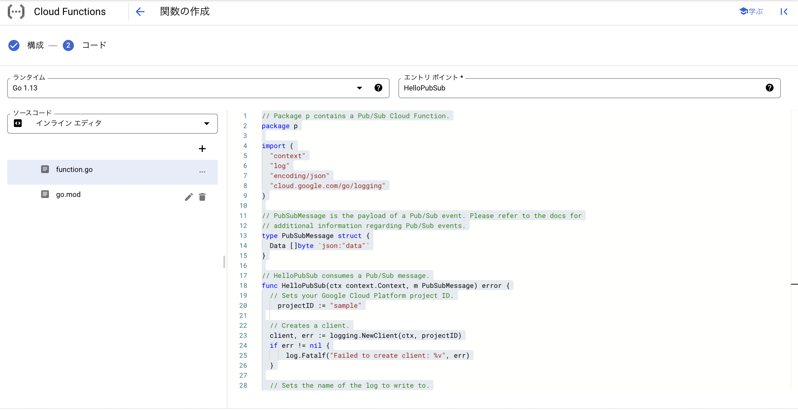
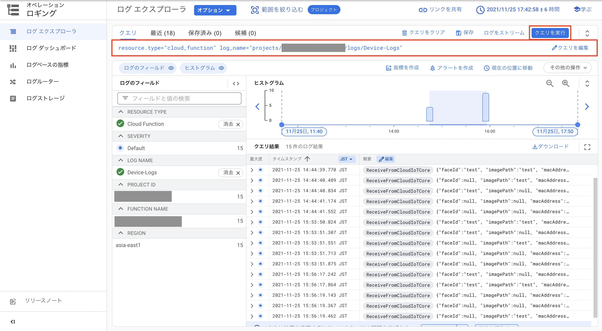

# send-data-to-google-cloud-iot-core-golang
AION では、主にエッジコンピューティング環境からデータを収集・管理維持するための Data Stack / Data Hub として、Google Cloud IoT Core を、一つの重要な選択肢として選択しています。       
AION では、Google Cloud IoT Core にエッジ環境からデータを送信するときに、Google Cloud Pub/Sub メッセージングモデルを採用した MQTT による通信が利用されています。  
本マイクロサービスは、エッジで RabbitMQ のキューから受け取ったメッセージを、エッジから Google Cloud IoT Core に送信するためのマイクロサービスです。  
送信されたメッセージは Google Cloud Pub/Sub のメッセージから確認することができますが、Topic に Stuck しているので、別途メッセージをデータとして活用したい場合は Google Cloud Storage などからサブスクライブしてください。  
本マイクロサービスは、エッジ環境側にセットアップされるリソースです。 

## 動作環境

* エッジコンピューティング環境（本マイクロサービスがデプロイされるエッジ端末）  
* OS: Linux OS  
* CPU: ARM/AMD/Intel  
* RabbitMQ もしくは AION 導入済みのエッジ環境　　  
* Kubernetes 導入済みのエッジ環境  
* Golang Runtime  

## アーキテクチャ  
以下のアーキテクチャでは、エッジコンピューティング環境 の send-data-to-google-cloud-iot-core-golang で取得したデータを Google IoT Core に送信し、Google Pub/Sub を経由して Google Cloud Functions に保存し、Google Cloud Logging から閲覧するまでを示しています。  




## Google Cloud における 設定  
send-data-to-google-cloud-iot-core-golang の使用には、Google Cloud Pub/Sub と Google Cloud IoT Core の設定が必要です。  
以下の手順で設定を行ってください。  

### Google Cloud Pub/Sub の設定
send-data-to-google-cloud-iot-core-golang はメッセージの送受信に Google Cloud Pub/Sub を利用します。  
以下の通りに Google Cloud Pub/Sub の設定を行ってください。 



```
1. Google Cloud Pub/Subのコンソール画面に移動します
2. メニューバー上部「トピックを作成」をクリックし、トピックを作成します  
3. トピックIDを sample と設定します
```
### Google Cloud IoT Core の設定  
send-data-to-google-cloud-iot-core-golang は端末の管理に Google Cloud IoT Core を利用します。  
以下の通りに Google Cloud IoT Core レジストリの設定を行ってください。  



```
1. Google Cloud IoT Coreのコンソール画面に移動します
2. メニューバー上部「レジストリを作成」をクリックし、レジストリを作成します
3. レジストリIDを sample と設定します
4. リージョンを asia-east1 と設定します
5. Google Cloud Pub/Sub トピックを 「Google Cloud Pub/Subの設定」で作成した project/yourProjectName/topics/sample に設定します

```

各種端末からメッセージを受けとるため、メニューバー左にある「デバイス」から端末の設定を行う必要があります。  
以下の通りに、Google Cloud IoT Core デバイスの設定を行ってください。  


```
1. Google Cloud IoT Coreのコンソール画面に移動します
2. メニューバー左 「デバイス」をクリックします
3. メニューバー上部 「デバイスを作成」をクリックします
4. デバイスIDを sample と設定します
5. 作成をクリックします
```

```
6. 作成したデバイスIDをクリックします
7. 詳細、構成、認証のタブのうち、認証タブをクリックします
8. 公開鍵を追加をクリックします
9. シェルで以下のコマンドを実行します
    $ openssl genrsa -out rsa_private.pem 2048
    $ openssl rsa -in rsa_private.pem -pubout -out rsa_cert.pem
```

```
10.rsa_cert.pem　の中身を「公開鍵の値」へ貼り付けます
11.追加をクリックします
```

## エッジ端末側のセットアップ

1. git cloneします  
```
git clone git@github.com:latonaio/send-data-to-google-cloud-iot-core-golang.git
```

2. goのパッケージをインストールします   
```
go mod download
go mod tidy
```

3. 秘密鍵を配置します  
send-data-to-google-cloud-iot-core-golang のルートディレクトリに Google Cloud IoT Core の設定で作成した「rsa_private.pem」を配置してください。  

4. .env を作成します    
.envを作成します。  
REGISTRY名などはセットアップで設定した値を利用しています。  
```
	GOOGLE_PROJECT=xxxx　　　　　　　　　　　　// GCPのプロジェクトID
	GOOGLE_REGISTRY=sample                 // IoT Core で設定したレジストリID
	GOOGLE_DEVICE=sample                   // IoT Core で設定したデバイスID
	ALGORITHM=RS256                        // 暗号化方式の指定  
	PRIVATE_KEY=./rsa_private.pem          // 利用する秘密鍵のパス
	REGION=asia-east1                      // IoT Core で設定したリージョン
	SERVER=ssl://mqtt.googleapis.com:8883  // GoogleのMQTTサーバ　[詳細](https://cloud.google.com/iot/docs/how-tos/mqtt-bridge)
	MAC_ADDRESS=xxxx                       // メッセージを送信したいデバイスのMACアドレス
	TERMINAL_NAME=xxxx                     // メッセージを送信したいデバイスの名前
  RABBITMQ_URL=xxxx                      // rabbitmq送信元のホスト名
  QUEUE_ORIGIN=xxxx                      // rabbitmq送信元のキュー名
```

5. テストを実行します  
接続確認のテストを行います。  
./sendDataGoogleIoT/sendDataGoogleIoT.go 内の.env で設定したものと同様の設定を、テストする関数のoption構造体に設定してください。  

```
go test ./sendDataGoogleIoT 
```

テストの実行に成功した場合、以下のような JSON が Google Cloud Pub/Sub に送られます。  

```
 {
faceId: null
imagePath: "test"
macAddress: "xx:xx:xx:xx:xx:xx"
responseData: null
terminalName: "xxxx"
}
```

JSON が Google Cloud Pub/Sub に送られたことは、Google Cloud Functions の　Cloud Logging から確認します。  
Cloud Logging からの確認ができるよう、次の手順で Google Cloud Functions の設定を行ってください。  

6. Google Cloud Functions の設定をします  



```
1. Google Cloud Functionsのコンソール画面に移動します
2. 関数名を sample と設定します
3. リージョンを asia-east1 と設定します
4. トリガーを Cloud Pub/Sub の sampleトピックに設定します
5. 保存をクリックします
6. 次へをクリックします
```



```
7. 以下のソースコードを Cloud functions のエディタに貼り付けます
```

```go
// Package p contains a Pub/Sub Cloud Function.
package p

import (
	"context"
	"log"
	"encoding/json"
	"cloud.google.com/go/logging"
)

// PubSubMessage is the payload of a Pub/Sub event. Please refer to the docs for
// additional information regarding Pub/Sub events.
type PubSubMessage struct {
	Data []byte `json:"data"`
}

// HelloPubSub consumes a Pub/Sub message.
func HelloPubSub(ctx context.Context, m PubSubMessage) error {
	// Sets your Google Cloud Platform project ID.
    projectID := "sample"

	// Creates a client.
	client, err := logging.NewClient(ctx, projectID)
	if err != nil {
			log.Fatalf("Failed to create client: %v", err)
	}

	// Sets the name of the log to write to.
	logName := "Device-Logs"

	// Selects the log to write to.
	logger := client.Logger(logName)


	// Adds an entry to the log buffer.
	logger.Log(logging.Entry{Payload: json.RawMessage(m.Data)})

	// Closes the client and flushes the buffer to the Cloud Logging
	// service.
	if err := client.Close(); err != nil {
			log.Fatalf("Failed to close client: %v", err)
	}


	return nil
}
```

7. Cloud Logging を実際に確認します  

Google Cloud Functions の設定により、トピックが受け取ったデータが Cloud Functions に Push され、Cloud Logging 上にログとして出力されるようになりました。    
テストの実行などでトリガーを発火させ、ログとして出力されたデータを Cloud Logging で確認してみましょう。  



```
1. Cloud Functionsのコンソール画面に移動します  
2. テストを実行します  
$ go test ./sendDataGoogleIoT  

3. Cloud Functionsでクエリを投げます  
resource.type="cloud_function"
log_name="projects/your_project/logs/Device-Logs"
```

## model.go

model.go には本マイクロサービスで使用される model が記載されています。  
CommunucationMQTT は、 Google Cloud Iot Core との通信において、MQTTクライアントの設定に使用される model です。  
MqMessageData は、主にエッジコンピューティング環境内において RabbitMQ のメッセージにより任意のマイクロサービスから受け取るデータの model であり、その一例として [azure-face-api-registrator-kube](https://github.com/latonaio/azure-face-api-registrator-kube) から受け取る AzureFaceAPI の顔画像のパス、Face ID、レスポンスデータが記載されています。       

```
type CommunucationMQTT struct {
	Projects    string
	Registry    string
	Device      string
	Algorithm   string
	Private_key string
	Region      string
	Server      string
	MacAddress  string
	Terminal    string
}
```

```
type MqMessageData struct {
	ImagePath    interface{}
	FaceId       interface{}
	ResponseData interface{}
}
```

CommunucationMQTT の 環境変数定義 は、 本レポジトリの send-data-to-google-cloud-iot-core-golang.yaml 内に記載されています。  

```
	var option model.CommunucationMQTT
	option.Projects = os.Getenv("GOOGLE_PROJECT")
	option.Registry = os.Getenv("GOOGLE_REGISTRY")
	option.Device = os.Getenv("GOOGLE_DEVICE")
	option.Algorithm = os.Getenv("ALGORITHM")
	option.Private_key = os.Getenv("PRIVATE_KEY")
	option.Region = os.Getenv("REGION")
	option.Server = os.Getenv("SERVER")
	option.MacAddress = os.Getenv("MAC_ADDRESS")
	option.Terminal = os.Getenv("TERMINAL_NAME")
```